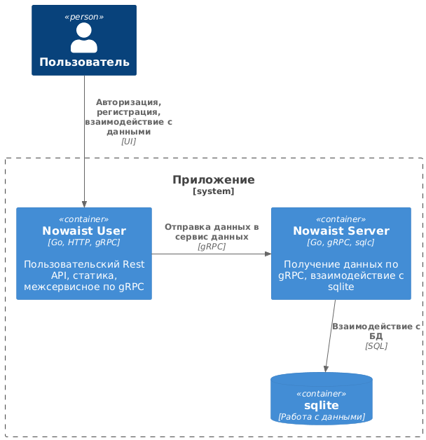

# Краткое описание проекта
В наше время актуально контролировать финансы, одним из способов является контроль расходов.
Но этот подход требует усидчивости, использования одной карты для удобства, минимизации переводов другим лицам,
иначе контроль превращается в головную боль.

Для себя я попробовал использовать контроль финансового состояния в целом, где записи будут представлять собой текущий объем финансов в разных статьях.

Так можно в любое время занести свое текущее состояние в приложение и отслеживать какой в целом тренд и где можно улучшить ситуацию.

# Стек
* Go
* chi
* sqlc + sqlite
* gRPC
* zerolog

# Структура системы

## Пользователь
* взаимодействует с UI
* регистрируется, авторизуется
* отправляет данные, получает данные в виде графика

## Nowaist User
* сервер http для обработки RestAPI запросов
* работа со статикой
* взаимодействует с данными по gRPC в сервис данных (адаптер Nowaist Server), является клиентом

## [Nowaist Server](https://github.com/khudaibirdin/nowaist_server)
* работа с данными по gRPC, получает и отдает данные, является сервером
* взаимодействует с БД через sqlc

# Развертывание
